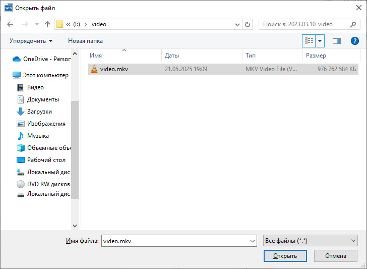
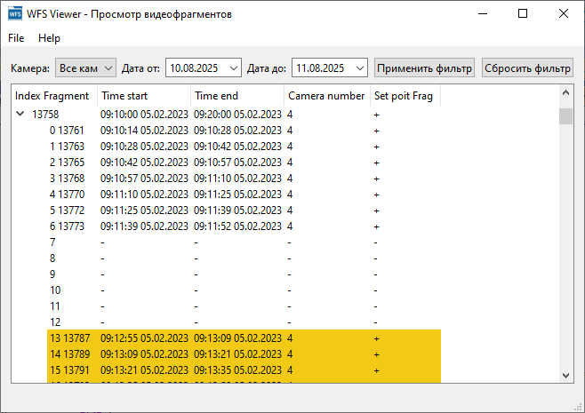
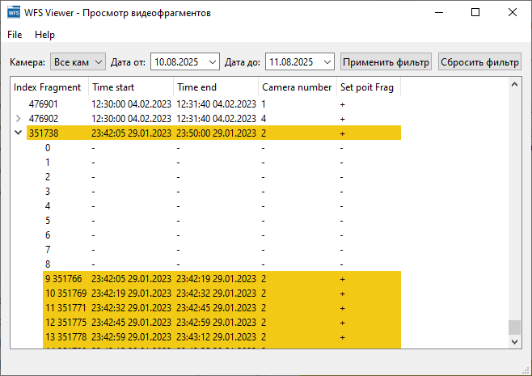
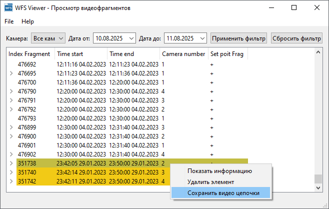
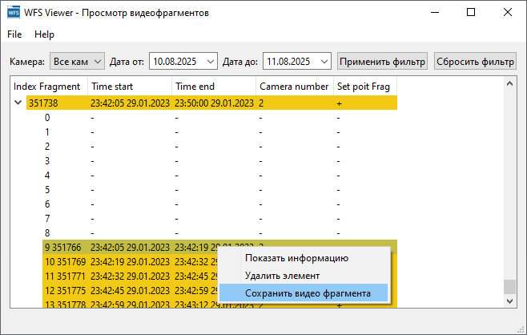

# WFS Project

## Краткое описание

Проект реализует интерфейс для взаимодействия с файловой системой WFS, используемой в некоторых системах видеонаблюдения (в частности, в регистраторах **Dahua** и совместимых моделях).
Функционал позволяет:
+ анализировать структуры служебных областей (**SuperBlock**, **IndexArea**, **DataArea**);
+ восстанавливать и экспортировать цепочки видеофрагментов, а также отдельные фрагменты.

## Документация

+ [Описание файловой системы WFS](docs/filesystem_wfs.md)
+ [Инструкция по сборке](docs/build_instructions.md)

## Структура проекта

```
WFS04
│   .gitattributes                   
│   .gitignore                       
│   README.md                        
│   wfs_console.sln                  # Файл решения Visual Studio, связные проекты
│                                    
├───docs                             # Документация проекта
│   │   build_instructions.md        # Инструкция по сборке
│   │   filesystem_wfs.md            # Описание файловой системы WFS
│   │                                
│   └───images                       # Изображения, используемые в документации
│                                    
├───wfs_console                      # Проект с основной логикой
│   │   wfs_console.cpp              
│   │   wfs_console.vcxproj          
│   │   wfs_console.vcxproj.filters  
│   │   wfs_console.vcxproj.user     
│   │                                
│   ├───core                         # Основная функционал по работе с WFS
│   │       FileSystem_WFS.cpp       
│   │       FileSystem_WFS.h         
│   │       struct_wfs.h             
│   │                                
│   └───io                           # Ввод-вывод: реализация работы с файлами
│           IFile.h                  
│           macFile.cpp              
│           macFile.h                
│           WinFile.cpp              
│           WinFile.h                
│                                    
└───wfs_gui                          # Проект GUI на Qt
    │   wfs_gui.vcxproj              
    │   wfs_gui.vcxproj.filters      
    │   wfs_gui.vcxproj.user         
    │                                
    ├───resources                    # Ресурсы GUI (иконки, qrc─файлы и прочее)
    │       AboutWindow.qrc          
    │       AboutWindow.qss          
    │       icon.png                 
    │       MainWindow.qrc           
    │                                
    ├───src                          # Исходный код GUI
    │   │   main.cpp                 
    │   │   MyTreeWidgetItem.cpp     
    │   │   MyTreeWidgetItem.h       
    │   │   utils.cpp                
    │   │   utils.h                  
    │   │                            
    │   └───Windows                  
    │           AboutWindow.cpp      
    │           AboutWindow.h        
    │           MainWindow.cpp       
    │           MainWindow.h         
    │                                
    └───ui                           # Файлы интерфейса Qt Designer (.ui)
            AboutWindow.ui           
            MainWindow.ui                 
```

## Пример работы программы

Тестирование программы проводилось с использованием файла-образа **video.mkv** файловой системы **WFS**. Для начала работы необходимо открыть такой файл:
<figure style="text-align: center;">
  
  <figcaption>Открытие файла-образа файловой системы <strong>WFS</strong></figcaption>
</figure>

После анализа файловой системы фрагменты группируются в цепочки, каждая из которых представлена в виде разворачиваемого элемента дерева.
Для наглядности применяются следующие цвета фона:
+ белый – дескрипторы, добавленные в результате обхода цепочки вторичных дескрипторов;
+ золотисто-желтый – дескрипторы, добавленные на основании информации из вторичного дескриптора об индексе главного дескриптора.

Пример: если цепочка неполная, после пропуска отсутствующих вторичных дескрипторах (например, при индексе главного дескриптора 13758 отсутствуют дескрипторы 7–12)   добавлены дескрипторы после выделяются золотисто-желтым цветом:
<figure style="text-align: center;">
  
  <figcaption>Различие между дескрипторами, добавленными по индексу главного дескриптора, и при обходе цепочки вторичных дескрипторов</figcaption>
</figure>

Если информация о главном дескрипторе изначально отсутствовала и была восстановлена на основе данных вторичных дескрипторов, он также выделяется золотисто-желтым фоном.
Пример: главный дескриптор с индексом 351738 был восстановлен на основании данных из имеющихся вторичных дескрипторов:
<figure style="text-align: center;">
  
  <figcaption>Восстановленный главный дескриптор</figcaption>
</figure>

После получения информации о дескрипторах можно сохранить соответствующие цепочки видеофрагментов:
<figure style="text-align: center;">
  
  <figcaption>Сохранение цепочки видеофрагментов</figcaption>
</figure>

Также доступно сохранение отдельных фрагментов видео:
<figure style="text-align: center;">
  
  <figcaption>Сохранение отдельного фрагмента</figcaption>
</figure>

# TODO

+ [ ] Анализ резервной копии **SuperBlock**, записанной в **IndexArea**
+ [ ] Восстановление **SecDesc**, частично перезаписанного резервной копией **SuperBlock**
+ [ ] Улучшение текущий интерфейс (отображение размера цепочки и фрагментов, отображение продолжительности цепочки и фрагментов, вывод полной информации во всплывающем окне, выбор и сохранение нескольких видеофрагментов)
+ [ ] Разработка универсального модуля демультиплексинга и декодирования видеофайлов формата **DHAV**
+ [ ] Добавление удобный интерфейс для воспроизведения и конвертации видеофайлов с возможностью настройки параметров качества и разрешения
+ [ ] Реализация восстановления цепочки видеофрагментов на основе распознавания даты, времени и номера камеры из видеоданных
+ [ ] Расширение функционала за счёт поддержки файловых систем других производителей видеорегистраторов, например, **Hikvision**, для создания универсального инструмента анализа и восстановления данных с различных устройств.

# Qt

Данное приложение использует библиотеку **Qt**, распространяемую по лицензии **GNU Lesser General Public License** (**LGPL**) версии 3.
Библиотеки **Qt** подключены динамически (через DLL), что позволяет пользователю при необходимости заменить их, как это предусмотрено условиями **LGPL**.
Исходный код **Qt** доступен по адресу: https://code.qt.io/
Полный текст лицензии **LGPL** v3 доступен на английском языке: https://www.gnu.org/licenses/lgpl-3.0.html
