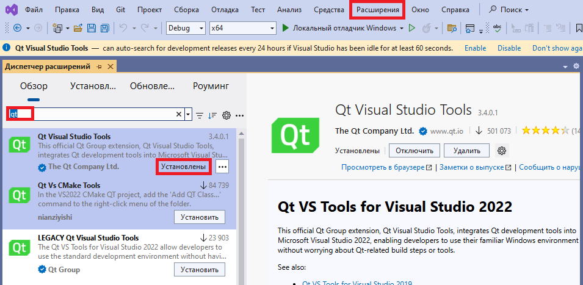
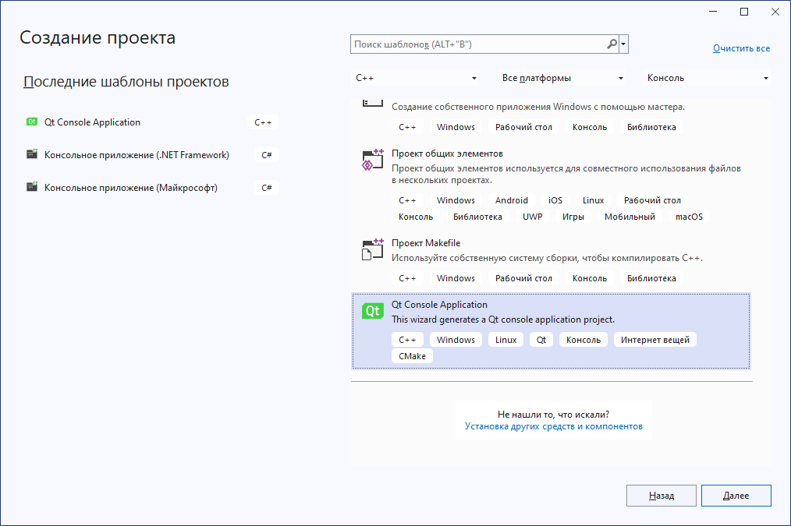
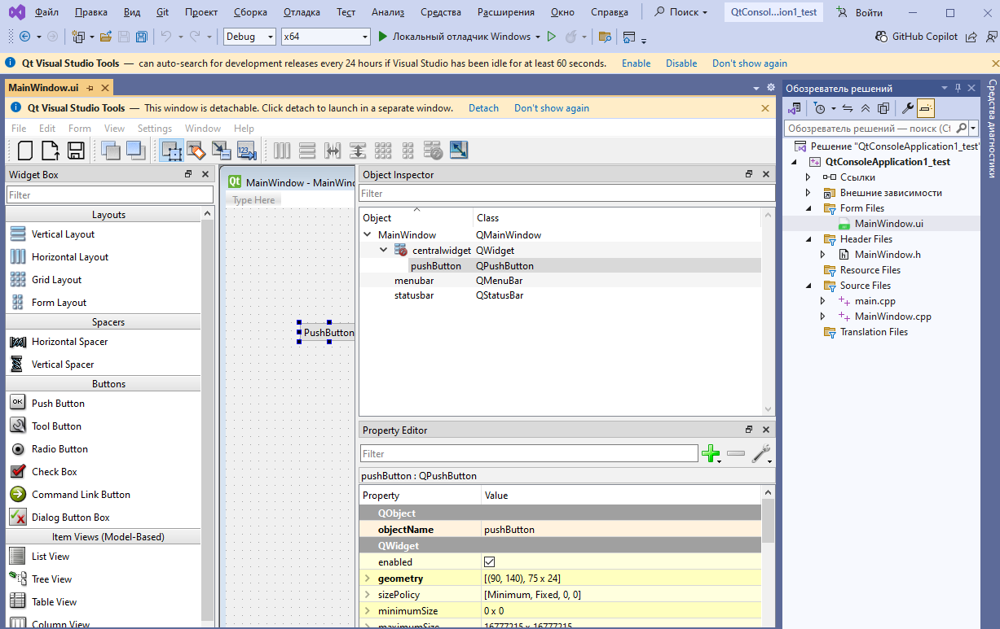
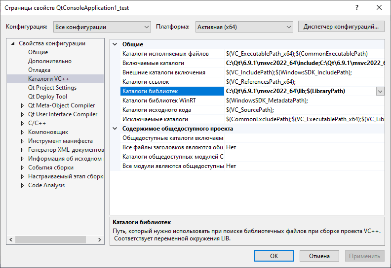
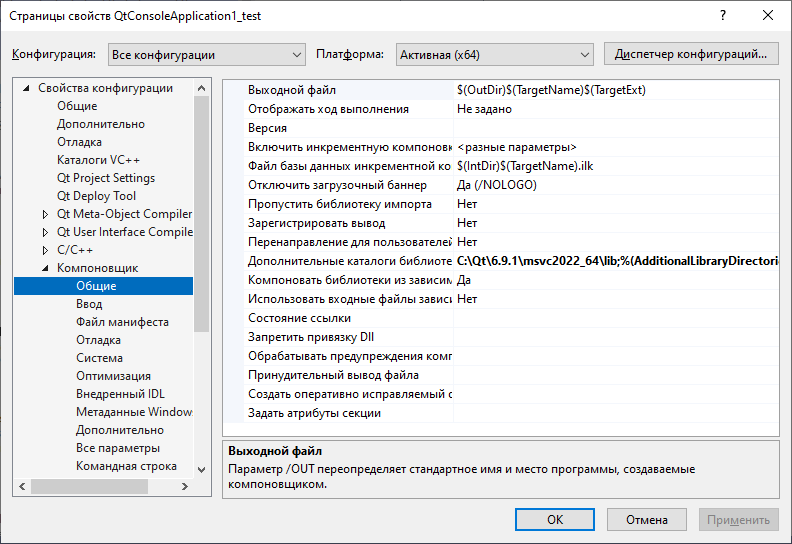
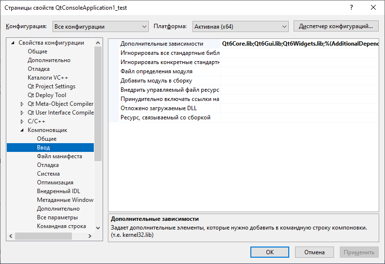
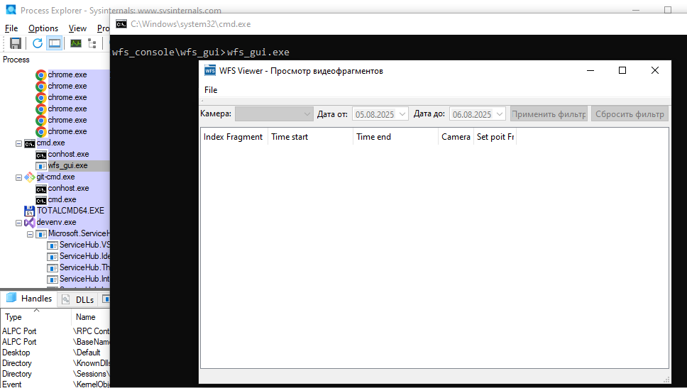

# Windows + Visual Studio

Перед началом убедитесь, что в **Visual Studio** установлен компонент **Desktop development with C++** и соответствующая версия компилятора **MSVC**.

Скачать с зеркала (например, с зеркала **mirror.yandex.ru**) следующих элементов **qtbase**, **qtdeclarative**, **qttools**, **qttranslations**:
```
curl -C - -O https://mirror.yandex.ru/mirrors/qt.io/online/qtsdkrepository/windows_x86/desktop/qt6_691/qt6_691/qt.qt6.691.win64_msvc2022_64/6.9.1-0-202505291653qtbase-Windows-Windows_11_23H2-MSVC2022-Windows-Windows_11_23H2-X86_64.7z
curl -C - -O https://mirror.yandex.ru/mirrors/qt.io/online/qtsdkrepository/windows_x86/desktop/qt6_691/qt6_691/qt.qt6.691.win64_msvc2022_64/6.9.1-0-202505291653qtdeclarative-Windows-Windows_11_23H2-MSVC2022-Windows-Windows_11_23H2-X86_64.7z
curl -C - -O https://mirror.yandex.ru/mirrors/qt.io/online/qtsdkrepository/windows_x86/desktop/qt6_691/qt6_691/qt.qt6.691.win64_msvc2022_64/6.9.1-0-202505291653qttools-Windows-Windows_11_23H2-MSVC2022-Windows-Windows_11_23H2-X86_64.7z
curl -C - -O https://mirror.yandex.ru/mirrors/qt.io/online/qtsdkrepository/windows_x86/desktop/qt6_691/qt6_691/qt.qt6.691.win64_msvc2022_64/6.9.1-0-202505291653qttranslations-Windows-Windows_11_23H2-MSVC2022-Windows-Windows_11_23H2-X86_64.7z
```

+ **qtbase** - основные библиотеки Qt, включающие ядро фреймворка, классы для работы с окнами, событиями, файловой системой, потоками и другими возможностями. Обязательно для любого Qt-приложения.
+ **qtdeclarative** - модуль, необходимый для создания интерфейсов с использованием QML – декларативного языка описания UI. Используется, если вы строите UI на QML.
+ **qttools** - набор инструментальных утилит и компонентов, включая Qt Designer (визуальный редактор форм), инструменты для генерации кода и других вспомогательных функций.
+ **qttranslations** — пакет с файлами перевода и локализации для библиотек Qt. Содержит готовые языковые ресурсы (файлы .qm) для стандартных сообщений, виджетов и компонентов Qt, позволяя приложению отображать интерфейс и системные тексты на разных языках. Используется для поддержки мультиязычности в приложениях на Qt.

Распакуем все архивы в один каталог. При возникновении конфликтов необходимо объединить каталоги:
```
C:\Qt\6.9.1\msvc2022_64
```


## Создание приложения и настройка проекта

Для упрощения работы с проектами, использующие Qt, в **Visual Studio** необходимо установить расширение **QT VS Tools**:
<figure style="text-align: center;">
  
  <figcaption>Добавление расширения <strong>Qt Visual Studio Tools</strong></figcaption>
</figure>

С помощью предустановленных шаблонов создадим тестовое решение:
<figure style="text-align: center;">
  
  <figcaption>Создание приложения с помощью шаблона</figcaption>
</figure>

Структура проекта:
```
main.cpp
MainWindow.cpp
MainWindow.h
MainWindow.ui
```

Содержимое **main.cpp**
```cpp
#include "mainwindow.h"
#include <QApplication>

int main(int argc, char* argv[]) {
    QApplication a(argc, argv);
    MainWindow w;
    w.show();
    return a.exec();
}
```

Класс **MainWindow** отвечает за работу GUI. Содержимое **MainWindow.cpp**:
```cpp
#include "MainWindow.h"
#include "ui_mainwindow.h"

MainWindow::MainWindow(QWidget* parent) : QMainWindow(parent), ui(new Ui::MainWindow) {
    ui->setupUi(this);
    connect(ui->pushButton, &QPushButton::clicked, this, &MainWindow::on_pushButton_clicked);
}

MainWindow::~MainWindow() {
    delete ui;
}

void MainWindow::on_pushButton_clicked() {
    // Действия при нажатии кнопки
    ui->pushButton->setText(QStringLiteral("111"));
}
```

Содержимое **MainWindow.h**:
```cpp
#include <QMainWindow>

QT_BEGIN_NAMESPACE
namespace Ui { class MainWindow; }
QT_END_NAMESPACE

class MainWindow : public QMainWindow {
    Q_OBJECT

public:
    MainWindow(QWidget* parent = nullptr);
    ~MainWindow();

private slots:
    void on_pushButton_clicked();  // обработчик нажатия кнопки

private:
    Ui::MainWindow* ui;
};
```

Пример файла **MainWindow.ui**, содержащий информацию о графическом интерфейсе:
<figure style="text-align: center;">
  
  <figcaption>Пример создания формы с помощью <strong>Qt Designer</strong></figcaption>
</figure>

После необходимо задать расположения заголовочных файлов.
Пункт меню:
```
Свойства конфигурации -> Каталог VC++ -> Включаемые каталоги:
```

Значение:
```
C:\Qt\6.9.1\msvc2022_64\include;
C:\Qt\6.9.1\msvc2022_64\include\QtWidgets;
C:\Qt\6.9.1\msvc2022_64\include\QtGui;
C:\Qt\6.9.1\msvc2022_64\include\QtCore;
```

Одной строкой:
```
C:\Qt\6.9.1\msvc2022_64\include;C:\Qt\6.9.1\msvc2022_64\include\QtWidgets;C:\Qt\6.9.1\msvc2022_64\include\QtGui;C:\Qt\6.9.1\msvc2022_64\include\QtCore
```

Далее установим расположение библиотеки Qt (\*.lib).
Пункт меню:
```
Свойства конфигурации -> Каталог VC++ -> Каталоги библиотек:
```

Значение:
```
C:\Qt\6.9.1\msvc2022_64\lib
```

Данные шаги выглядят так:
<figure style="text-align: center;">
  
  <figcaption>Добавление заголовков <strong>Qt</strong></figcaption>
</figure>

Добавим линкеру пути расположения библиотеки Qt (\*.lib) для корректной сборки проекта
Пункт меню:
```
Свойства конфигурации -> Компоновщик -> Общие -> Дополнительные каталоги библиотек:
```

Значение:
```
C:\Qt\6.9.1\msvc2022_64\lib
```

<figure style="text-align: center;">
  
  <figcaption>Настройка компоновщика для подключения <strong>Qt-библиотек</strong></figcaption>
</figure>

Пункт меню:
```
Свойства конфигурации -> Компоновщик -> Ввод -> Дополнительные зависимости:
```

Значение:
```
Qt6Core.lib;
Qt6Gui.lib;
Qt6Widgets.lib;
```

Одной строкой:
```
Qt6Core.lib;Qt6Gui.lib;Qt6Widgets.lib
```

<figure style="text-align: center;">
  
  <figcaption>Добавление в компоновщик библиотек <strong>Qt</strong></figcaption>
</figure>

После проделанных шагов приложение будет успешно запущено.

## Запуск Debug версии без Visual Studio

Для автоматического копирования зависимых DLL и плагинов в каталог приложения можно воспользоваться утилитой **windeployqt**:
```
"C:\Qt\6.9.1\msvc2022_64\bin\windeployqt.exe" --debug wfs_gui.exe
```

Пример **bat-файла** для копирования библиотек:
```cmd
@echo off
setlocal enabledelayedexpansion
chcp 65001

:: Установи путь к Qt
set QT_ROOT=C:\Qt\6.9.1\msvc2022_64

:: Целевой каталог — по умолчанию текущий
set TARGET_DIR=\x64\Debug

:: Создаем подкаталоги
mkdir "%TARGET_DIR%\platforms"    >nul 2>nul
mkdir "%TARGET_DIR%\styles"       >nul 2>nul
mkdir "%TARGET_DIR%\imageformats" >nul 2>nul

echo Копирование Qt плагинов...

:: Базовые библиотеки
copy "%QT_ROOT%\bin\Qt6Core.dll"                     "%TARGET_DIR%\" >nul
copy "%QT_ROOT%\bin\Qt6Cored.dll"                    "%TARGET_DIR%\" >nul
copy "%QT_ROOT%\bin\Qt6Gui.dll"                      "%TARGET_DIR%\" >nul
copy "%QT_ROOT%\bin\Qt6Guid.dll"                     "%TARGET_DIR%\" >nul
copy "%QT_ROOT%\bin\Qt6Networkd.dll"                 "%TARGET_DIR%\" >nul
copy "%QT_ROOT%\bin\Qt6Widgets.dll"                  "%TARGET_DIR%\" >nul
copy "%QT_ROOT%\bin\Qt6Widgetsd.dll"                 "%TARGET_DIR%\" >nul

:: Плагины платформ
copy "%QT_ROOT%\plugins\platforms\qdirect2d.dll"     "%TARGET_DIR%\platforms\" >nul
copy "%QT_ROOT%\plugins\platforms\qdirect2dd.dll"    "%TARGET_DIR%\platforms\" >nul
copy "%QT_ROOT%\plugins\platforms\qminimal.dll"      "%TARGET_DIR%\platforms\" >nul
copy "%QT_ROOT%\plugins\platforms\qminimald.dll"     "%TARGET_DIR%\platforms\" >nul
copy "%QT_ROOT%\plugins\platforms\qoffscreen.dll"    "%TARGET_DIR%\platforms\" >nul
copy "%QT_ROOT%\plugins\platforms\qoffscreend.dll"   "%TARGET_DIR%\platforms\" >nul
copy "%QT_ROOT%\plugins\platforms\qwindows.dll"      "%TARGET_DIR%\platforms\" >nul
copy "%QT_ROOT%\plugins\platforms\qwindowsd.dll"     "%TARGET_DIR%\platforms\" >nul

:: Стили
copy "%QT_ROOT%\plugins\styles\qmodernwindowsstyle.dll"  "%TARGET_DIR%\styles\" >nul
copy "%QT_ROOT%\plugins\styles\qmodernwindowsstyled.dll" "%TARGET_DIR%\styles\" >nul

:: Форматы изображений
copy "%QT_ROOT%\plugins\imageformats\qgif.dll"     "%TARGET_DIR%\imageformats\" >nul
copy "%QT_ROOT%\plugins\imageformats\qgifd.dll"    "%TARGET_DIR%\imageformats\" >nul
copy "%QT_ROOT%\plugins\imageformats\qico.dll"     "%TARGET_DIR%\imageformats\" >nul
copy "%QT_ROOT%\plugins\imageformats\qicod.dll"    "%TARGET_DIR%\imageformats\" >nul
copy "%QT_ROOT%\plugins\imageformats\qjpeg.dll"    "%TARGET_DIR%\imageformats\" >nul
copy "%QT_ROOT%\plugins\imageformats\qjpegd.dll"   "%TARGET_DIR%\imageformats\" >nul

echo Готово!
pause
```

В результате выполнения этих действий будет следующая структура каталога, содержащего исполняемый файл **wfs_gui.exe**:
```
│   D3Dcompiler_47.dll
│   Qt6Core.dll
│   Qt6Cored.dll
│   Qt6Gui.dll
│   Qt6Guid.dll
│   Qt6Networkd.dll
│   Qt6Widgets.dll
│   Qt6Widgetsd.dll
│   wfs_console.exe
│   wfs_console.pdb
│   wfs_gui.exe
│   wfs_gui.pdb
│
├───generic
│       qtuiotouchplugind.dll
│
├───imageformats
│       qgif.dll
│       qgifd.dll
│       qico.dll
│       qicod.dll
│       qjpeg.dll
│       qjpegd.dll
│
├───networkinformation
│       qnetworklistmanagerd.dll
│
├───platforms
│       qdirect2d.dll
│       qdirect2dd.dll
│       qminimal.dll
│       qminimald.dll
│       qoffscreen.dll
│       qoffscreend.dll
│       qwindows.dll
│       qwindowsd.dll
│
├───styles
│       qmodernwindowsstyle.dll
│       qmodernwindowsstyled.dll
│
├───tls
│       qcertonlybackendd.dll
│       qschannelbackendd.dll
│
└───translations
        qt_ar.qm
        qt_bg.qm
        qt_ca.qm
        qt_cs.qm
        qt_da.qm
        qt_de.qm
        qt_en.qm
        qt_es.qm
        qt_fa.qm
        qt_fi.qm
        qt_fr.qm
        qt_gd.qm
        qt_he.qm
        qt_hr.qm
        qt_hu.qm
        qt_it.qm
        qt_ja.qm
        qt_ka.qm
        qt_ko.qm
        qt_lv.qm
        qt_nl.qm
        qt_nn.qm
        qt_pl.qm
        qt_pt_BR.qm
        qt_ru.qm
        qt_sk.qm
        qt_tr.qm
        qt_uk.qm
        qt_zh_CN.qm
        qt_zh_TW.qm
```

После чего можно запустить приложение без проблем:
<figure style="text-align: center;">
  
  <figcaption>Успешный запуск <strong>Debug</strong> версии программы</figcaption>
</figure>

## Запуск Release версии без Visual Studio

```
"C:\Qt\6.9.1\msvc2022_64\bin\windeployqt.exe" --release wfs_gui.exe
```

Минимальный набор библиотек **Qt** для функционирования **Release** сборки:
```
│   Qt6Core.dll
│   Qt6Gui.dll
│   Qt6Widgets.dll
│   wfs_gui.exe
│
├───platforms
│       qwindows.dll
│
└───styles
        qmodernwindowsstyle.dll
```