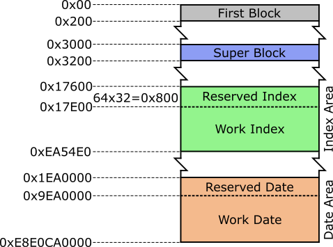
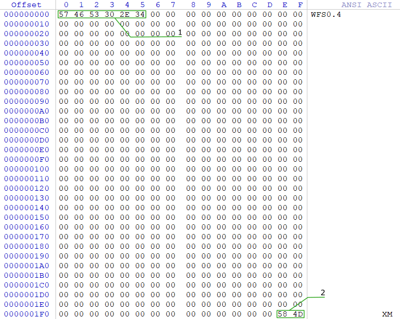
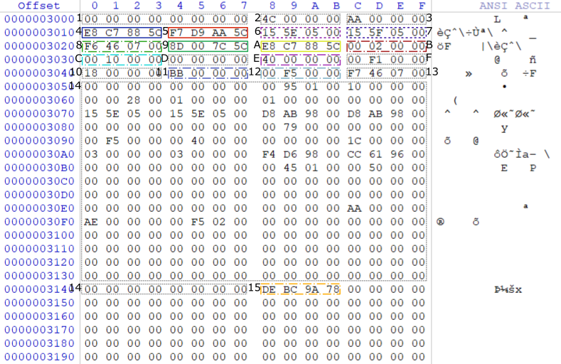
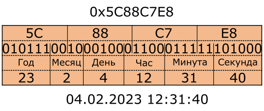
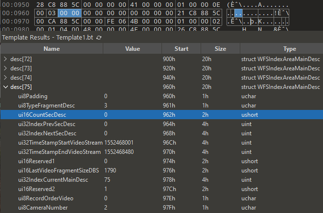
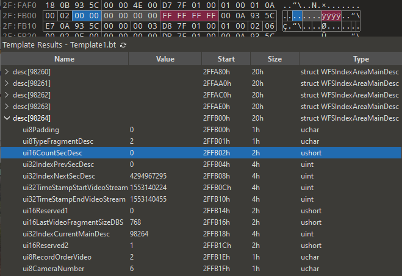
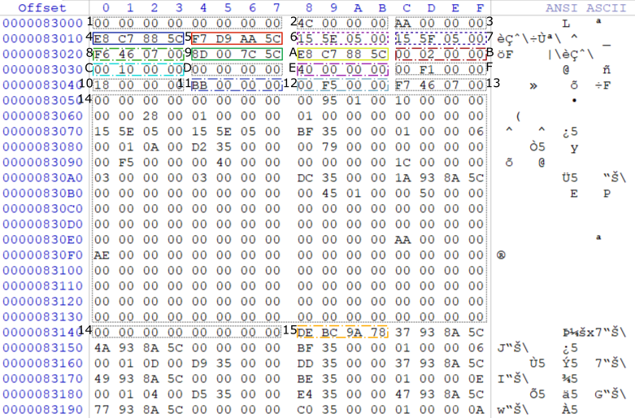
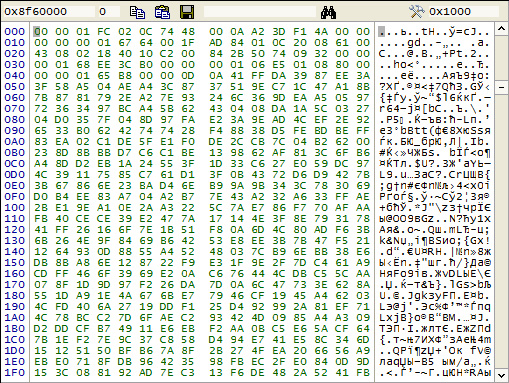
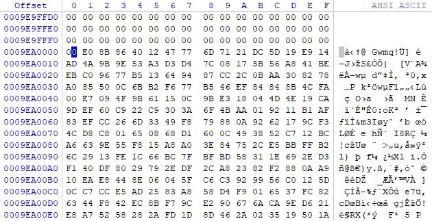
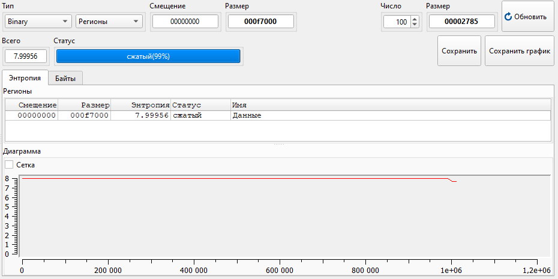

# Описание

Файловая система **WFS** используется в бюджетных устройствах цифровой видеозаписи (**DVR**). Ее основное предназначение – максимально эффективное сохранение видеопотока с минимальными затратами на избыточную структуру метаданных, что позволяет работать в условиях ограниченных вычислительных ресурсов и объемов памяти.

Формат **WFS** спроектирован с приоритетом на высокую скорость записи и упрощенный доступ к данным. Его структура обеспечивает быстрый переход к видеофрагментам и ключевым областям, необходимым для навигации и чтения содержимого.

Основные элементы файловой системы **WFS** включают:
+ **FirstBlock** – первый сектор данных, содержащий сигнатуру файловой системы **WFS**.
+ **SuperBlock** – блок данных, расположенный по смещению `0x3000`, содержит основную информацию о файловой системе (расположение **IndexArea** и **DataArea**). Фактически под данный блок данных отведено 332 байта согласно известной структуре данных.
+ **IndexArea** – область данных содержит видеодескрипторы, описывающие видеофрагменты из **DataArea**. Дескрипторы бывают нескольких типов: главный, вторичный, зарезервированный, а также могут встречаться иные данные. На основании ссылок на предыдущие и следующие дескрипторы строится цепочка видеофрагментов.
+ **DataArea** – область, содержащая непосредственно видеоданные. Связь между дескрипторами и видеоблоками осуществляется по совпадению индекса дескриптора и индекса соответствующего видеофрагмента.

Рассмотрение структуры **WFS** проводится на основе файловой системы, размещенной на диске емкостью 1 ТБ.

Общая структура файловой системы представлена на следующей схеме:
<figure style="text-align: center;">
  
  <figcaption>Структура файловой системы <strong>WFS</strong></figcaption>
</figure>

## FirstBlock

**FirstBlock** – это первый сектор файловой системы **WFS**, размером 512 байт. Он содержит базовую идентификационную информацию, позволяющую системе распознать тип файловой системы и подтвердить корректность чтения. Информация об устройстве первого блока файловой системы **WFS** (размером 512 байт): 
<figure style="text-align: center;">
  
  <figcaption>Первый блок <strong>WFS</strong></figcaption>
</figure>

Структура сектора:

| №   | Смещение | Размер, байт | Описание                                                                                                |
| --- | -------- | ------------ | ------------------------------------------------------------------------------------------------------- |
| 1   | 0x00     | 6            | Сигнатуру файловой системы (6 байт) **WFS0.4** (**0x574653302E34**) или **WFS0.5** (**0x574653302E35**) |
| 2   | 0x2FE    | 2            | Конец первого блока, содержит значение **XM** (**0x584D**)                                              |

Сигнатура позволяет определить версию файловой системы: 0.4 или 0.5.
Значение **XM** в конце блока может использоваться как контрольная метка или подтверждение завершения сектора.

## SuperBlock

**SuperBlock** располагается по смещению `0x3000`. Все числовые значения в файловой системе **WFS** представлены в формате little-endian (младший байт первым).

Блок содержит ключевую информацию о структуре и текущем состоянии файловой системы, включая:
+ смещения областей **IndexArea** и **DataArea**;
+ временные метки последних записей;
+ размер видеофрагментов;
+ количество всех и количество зарезервированных видеофрагментов.

<figure style="text-align: center;">
  
  <figcaption>Структура <strong>SuperBlock</strong></figcaption>
</figure>

| №   | Смещение | Размер, байт | Описание                                                                                 |
| --- | -------- | ------------ | ---------------------------------------------------------------------------------------- |
| 1   | 0x00     | 8            | Зарезервированное поле                                                                   |
| 2   | 0x08     | 4            | Зарезервированное поле. Были замечены следующие значения: 0x4C (76), 0x01                |
| 3   | 0x0C     | 4            | Зарезервированное поле. Были замечены следующие значения: 0xAA (170), 0x00               |
| 4   | 0x10     | 4            | Временная метка последнего видеофрагмента, записанного в **DataArea**                    |
| 5   | 0x14     | 4            | Временная метка последнего видеофрагмента, записанного оборудованием                     |
| 6   | 0x18     | 4            | Смещение последнего дескриптора видеофрагмента в **IndexArea**, добавленного устройством |
| 7   | 0x1C     | 4            | Смещение первого валидного дескриптора после тех, что будут перезаписаны                 |
| 8   | 0x20     | 4            | Общее количество видеофрагментов                                                         |
| 9   | 0x24     | 4            | Временная метка первого допустимого видеофрагмента (после перезаписи старых)             |
| 10  | 0x28     | 4            | Временная метка начала первого видеофрагмента в **DataArea**                             |
| 11  | 0x2C     | 4            | Размер дискового блока (**DBS**)                                                         |
| 12  | 0x30     | 4            | Размер одного видеофрагмента в **DBS**                                                   |
| 13  | 0x34     | 4            | Зарезервированное поле                                                                   |
| 14  | 0x38     | 4            | Количество зарезервированных видеофрагментов                                             |
| 15  | 0x3C     | 4            | Зарезервированное поле                                                                   |
| 16  | 0x40     | 4            | Зарезервированное поле                                                                   |
| 17  | 0x44     | 4            | Начальная позиция **IndexArea** (в **DBS**)                                              |
| 18  | 0x48     | 4            | Начальная позиция **DataArea** (в **DBS**)                                               |
| 19  | 0x4C     | 4            | Зарезервированное поле                                                                   |
| 20  | 0x50     | 248          | Зарезервированное поле                                                                   |
| 21  | 0x148    | 4            | Сигнатура окончания **SuperBlock** – **0xDEBC9A78**                                      |

### Формат временных меток

В структуре **SuperBlock** встречаются временные метки по смещениям `0x10`, `0x14`, `0x24`, `0x28`. Они представлены в 4-байтовом поле со следующим распределением битов:
+ 6 бит (31-26) – год;
+ 4 бита (25-22) – месяц;
+ 5 бит (21-17) – день;
+ 5 бит (16-12) – час;
+ 6 битов (11-6) – минута;
+ 6 битов (5-0) - секунда.

Пример:
Рассмотрим временную метку `0x5C88C7E8`:
```
Двоичное представление:
01011100100010001100011111101000
ГГГГГГММММДДДДДЧЧЧЧЧммммммсссссс

Год:      010111 → 23 → 2023
Месяц:    0010   → 2  → Февраль
День:     00100  → 4
Час:      01100  → 12
Минута:   011111 → 31
Секунда:  101000 → 40
```

<figure style="text-align: center;">
  
  <figcaption>Формат хранения временных меток</figcaption>
</figure>

Пример реализации преобразования временной метки (на C++):
```cpp
WFSDateTime FileSystem_WFS::convertTime(uint32_t inUi32TimeValue) {
	uint8_t ui8ShiftYear = 26;
	uint8_t ui8ShiftMonth = 22;
	uint8_t ui8ShiftDay = 17;
	uint8_t ui8ShiftHour = 12;
	uint8_t ui8ShiftMinuts = 6;
	uint8_t ui8ShiftSeconds = 0;
	uint8_t ui8MaskYear = 63;		// mask - 111111 6 единиц
	uint8_t ui8MaskMonth = 15;		// mask - 1111 4 единиц
	uint8_t ui8MaskDay = 31;		// mask - 11111 5 единиц
	uint8_t ui8MaskHour = 31;		// mask - 11111 5 единиц
	uint8_t ui8MaskMinuts = 63;		// mask - 111111 6 единиц
	uint8_t ui8MaskSeconds = 63;	// mask - 111111 6 единиц

	WFSDateTime stDataWFS;
	stDataWFS.ui16Year = inUi32TimeValue >> ui8ShiftYear;
	stDataWFS.ui16Year = 2000 + (stDataWFS.ui16Year & ui8MaskYear);
	stDataWFS.ui8Month = inUi32TimeValue >> ui8ShiftMonth;
	stDataWFS.ui8Month = stDataWFS.ui8Month & ui8MaskMonth;
	stDataWFS.ui8Day = inUi32TimeValue >> ui8ShiftDay;
	stDataWFS.ui8Day = stDataWFS.ui8Day & ui8MaskDay;
	stDataWFS.ui8Hour = inUi32TimeValue >> ui8ShiftHour;
	stDataWFS.ui8Hour = stDataWFS.ui8Hour & ui8MaskHour;
	stDataWFS.ui8Minutes = inUi32TimeValue >> ui8ShiftMinuts;
	stDataWFS.ui8Minutes = stDataWFS.ui8Minutes & ui8MaskMinuts;
	stDataWFS.ui8Seconds = inUi32TimeValue >> ui8ShiftSeconds;
	stDataWFS.ui8Seconds = stDataWFS.ui8Seconds & ui8MaskSeconds;
	return stDataWFS;
}
```

## IndexArea

**IndexArea** – область данных, содержащая видеодескрипторы, описывающие видеофрагменты из **DataArea**. Внутри **IndexArea** видеодескрипторы размещаются последовательно, в порядке их логической нумерации. Каждый дескриптор занимает 32 байта. Информация о типе дескриптора располагается по смещению `0x01` относительно начала дескриптора. Возможные типы видеодескрипторов:
+ главный (**Main**: `0x02/0x03`);
+ вторичный (**Sec**: `0x01`);
+ зарезервированный (`0xFE`).

Также в данной области могут встречаться данные, не являющиеся дескрипторами. Структура и описание полей видеодескрипторов **IndexArea** (**MainDesc** и **SecDesc**):

| №   | Смещение | Размер, байт | Описание                                                                                                                                                                                         |
| --- | -------- | ------------ | ------------------------------------------------------------------------------------------------------------------------------------------------------------------------------------------------ |
| 1   | 0x00     | 1            | **Main/Sec**: зарезервированное поле                                                                                                                                                             |
| 2   | 0x01     | 1            | **MainDesc**: тип дескриптора – `0x02/0x03`<br>**SecDesc**: тип дескриптора – `0x01`<br>Зарезервированный – `0xFE`                                                                               |
| 3   | 0x02     | 2            | **MainDesc**: количество вторичных дескрипторов<br>**SecDesc**: относительный номер вторичного дескриптора после основного                                                                       |
| 4   | 0x04     | 4            | **MainDesc**: в основном дескрипторе поле должно быть заполнено нулями (`0x00000000`), так как у него нет предыдущего дескриптора<br>**SecDesc**: индекс предыдущего дескриптора                 |
| 5   | 0x08     | 4            | **Main/Sec**: индекс следующего дескриптора.<br>Если в **MainDesc** отсутствуют **SecDesc** то будет значение `0xffffffff` или `0x00000000`. В последнем **SecDesc** будет значение `0x00000000` |
| 6   | 0x0C     | 4            | **MainDesc**: метка времени начала потока<br>**SecDesc**: метка времени начала видеофрагмента                                                                                                    |
| 7   | 0x10     | 4            | **MainDesc**: метка времени конца потока<br>**SecDesc**: метка времени конца видеофрагмента                                                                                                      |
| 8   | 0x14     | 2            | **Main/Sec**: зарезервированное поле. Заполнение нулями                                                                                                                                          |
| 9   | 0x16     | 2            | **Main/Sec**: Размер последнего видеофрагмента в DBS. Данный размер содержится только в **MainDesc** и последнем **SecDesc**, в других **SecDesc** будет значение `0x00000000`                   |
| 10  | 0x18     | 4            | **MainDesc**: индекс текущего **MainDesc**<br>**SecDesc**: индекс **MainDesc** к которому относится **SecDesc**                                                                                  |
| 11  | 0x1C     | 2            | **Main/Sec**: зарезервированное поле                                                                                                                                                             |
| 12  | 0x1E     | 1            | **Main/Sec**: порядок записи. У вторичных дескрипторов всегда `0x00`                                                                                                                             |
| 13  | 0x1F     | 1            | **Main/Sec**: номер камеры: первая - `0x02`, вторая - `0x06`, третья - `0x0A`                                                                                                                    |

### Примеры дескрипторов
#### Главный дескриптор

Пример главного дескриптора без вторичных (значение `0x00000000`):
```
0x017f60: 00 03 00 00 00 00 00 00 00 00 00 00 21 c8 88 5c
0x017f70: 00 ca 88 5c 00 00 fe 06 4b 00 00 00 01 00 00 02
```

<figure style="text-align: center;">
  
  <figcaption>Пример главного дескриптора содержащий значение <strong>0x00000000</strong></figcaption>
</figure>


Еще один приме главного дескриптора без вторичных (значение `0xffffffff`):
```
0x317100: 00 02 00 00 00 00 00 00 ff ff ff ff 00 0a 93 5c
0x317110: e7 0a 93 5c 00 00 00 03 d8 7f 01 00 01 00 02 06
```

<figure style="text-align: center;">
  
  <figcaption>Пример главного дескриптора содержащий значение <strong>0xffffffff</strong></figcaption>
</figure>

#### Вторичный дескриптор

Последний в цепочке:
```
0x018920: 00 01 23 00 97 00 00 00 00 00 00 00 f5 c9 88 5c
0x018930: 00 ca 88 5c 00 00 b8 07 40 00 00 00 01 00 00 06
```

#### Зарезервированный дескриптор

```
0x017600: 00 fe 00 00 00 00 00 00 00 00 00 00 00 00 00 00
0x017610: 00 00 00 00 00 00 00 00 00 00 00 00 00 00 00 00
```

### Разметка области IndexArea

В ходе подсчета дескрипторов была обнаружена особенность, связанная с размещением резервной копии **SuperBlock** внутри **IndexArea**. Несмотря на то, что основное назначение **IndexArea** – хранение видеодескрипторов, в ней может находиться полная копия **SuperBlock**, занимающая 332 байта. Это следует учитывать при анализе и подсчете количества дескрипторов, так как данные копии не соответствуют формату дескрипторов и могут быть ошибочно приняты за них.

| Смещение | Размер, байт | Описание                                                                                                                                                                                              |
| -------- | ------------ | ----------------------------------------------------------------------------------------------------------------------------------------------------------------------------------------------------- |
| 0x17600  | 2048         | **IndexArea** начинается с зарезервированных видеодескрипторов. В данном случае их 64.                                                                                                                |
| 0x17E00  | 438784       | Начало рабочей части **IndexArea**. Здесь располагается первый рабочий дескриптор                                                                                                                     |
| 0x83000  | 332          | Копия **SuperBlock**                                                                                                                                                                                  |
| 0x8314C  | 20           | Последние 20 байт конца вторичного или главного дескриптора                                                                                                                                           |
| 0x83160  | 14820224     | Продолжение дескрипторов с данного адреса                                                                                                                                                             |
| 0xEA54E0 | -            | Конец **IndexArea**. Адрес рассчитан по формуле: 0x17600 + 476918 × 32 + 32 где:<br>476918 – количество всех  видеодескрипторов, берется из **SuperBlock**<br>32 – размер одного дескриптора в байтах |

<figure style="text-align: center;">
  
  <figcaption>Расположение копии <strong>SuperBlock</strong> в <strong>IndexArea</strong></figcaption>
</figure>

## DataArea

В данной области содержатся данные видеофрагментов. Установлено, что возможны несколько вариантов хранимых данных:
+ видеофрагменты (предположительно кодек H.264) начинающиеся после последовательности байт `0x00 0x00 0x01 0xFC 0x02 0x19 0x74 0x48`:
<figure style="text-align: center;">
  
  <figcaption>Пример данных видеофрагмента  (изображение взято с сайта <strong>hddmasters.by</strong>)</figcaption>
</figure>

+ Видеофрагменты в формате **DHAV** (проприетарный формат от **Dahua**). Формат **DHAV** (или **DAV**) – это проприетарный контейнер, применяемый в видеорегистраторах **Dahua**. Для просмотра таких файлов доступен официальный проигрыватель [Dahua Smart Player](https://www.dahua.market/software/General_SmartPlayer-Win32_Eng_IS_V4.003.0000000.0.R.230519.zip):

<figure style="text-align: center;">
  
  <figcaption>Пример данных видеофрагмента формата <strong>DHAV</strong></figcaption>
</figure>

Также можно сказать, что фрагменты данного формата имеют высокую энтропию, что может свидетельствовать о сжатии данных или о шифровании:
<figure style="text-align: center;">
  
  <figcaption>Анализ энтропии видеофрагментов из <strong>DataArea</strong></figcaption>
</figure>

Помимо воспроизведения видеофайлов формата **DHAV** с помощью **Dahua Smart Player**, их можно предварительно преобразовать с использованием **ffmpeg**, а затем открыть в любых распространённых медиаплеерах:
+ Вариант с фиксированным разрешением 640×480 и высоким качеством при разумном размере файла (`-crf 14`):
```bash
ffmpeg.exe -f h264 -i chain_main_desc_64.dav -s 640x480 -crf 14 chain_main_desc_64_low_quality.mp4
```

+ Вариант с максимальным качеством (`-crf 0`), разрешение видео извлекается автоматически из потока:
```bash
ffmpeg.exe -f h264 -i chain_main_desc_64.dav -crf 0 chain_main_desc_64_max_quality.mp4
```

Преобразование выполняется с помощью встроенного в **ffmpeg** демультиплексера **DHAV**, исходный код которого доступен на GitHub в файле [**dhav.c**](https://github.com/FFmpeg/FFmpeg/blob/master/libavformat/dhav.c).

Сравнение размера исходного файла **chain_main_desc_64.dav** с файлами полученными после преобразования:

| Название файла                     | Разрешение | Размер, байт |
| ---------------------------------- | ---------- | ------------ |
| chain_main_desc_64.dav             | -          | 74412032     |
| chain_main_desc_64_low_quality.mp4 | 640x480    | 42022339     |
| chain_main_desc_64_max_quality.mp4 | 1920x1080  | 1237006622   |

# Источники информации

1. [Восстановление данных с видеорегистраторов.](https://disk-on.ru/articles/datarecovery_wfs04)
2. [Восстановление видеозаписей из системы видеонаблюдения, использующей WFS0.4](http://hddmasters.by/articles/vosstanovlenie_iz_videoregistratora_wfs04.html)
3. [Analysis and recovery of videos from the WFS file system.](https://educapes.capes.gov.br/bitstream/capes/704325/1/ANALYSISAND.pdf)
